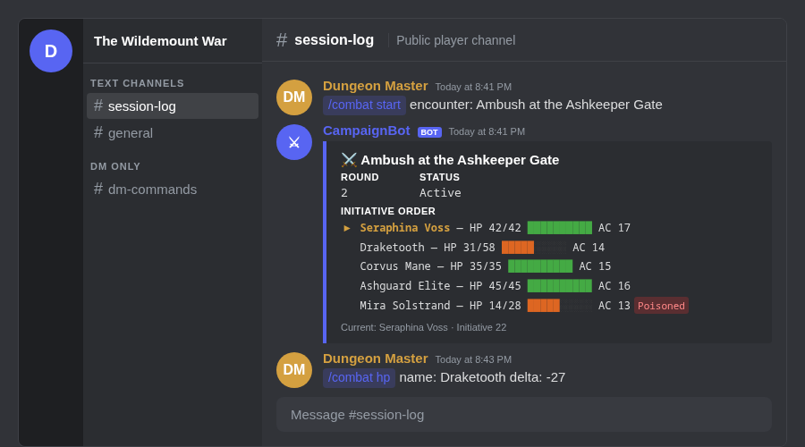
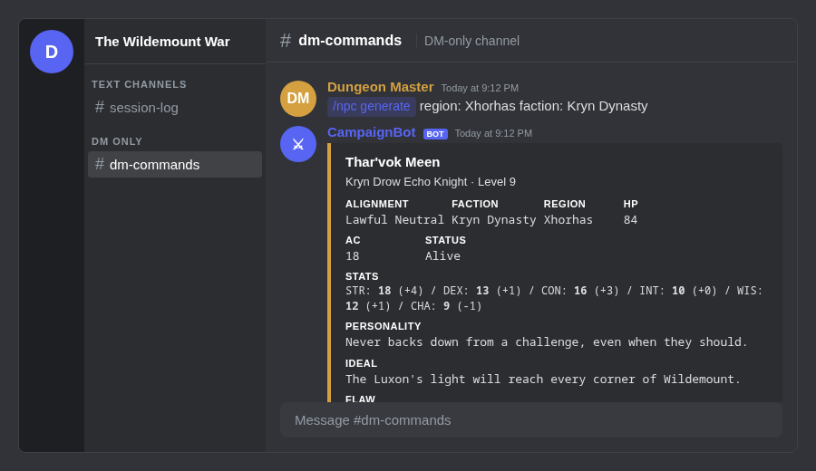
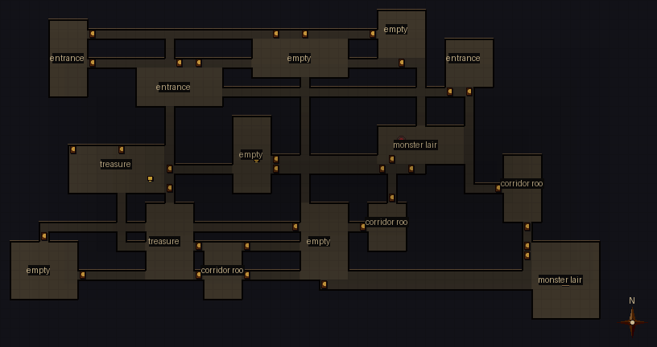
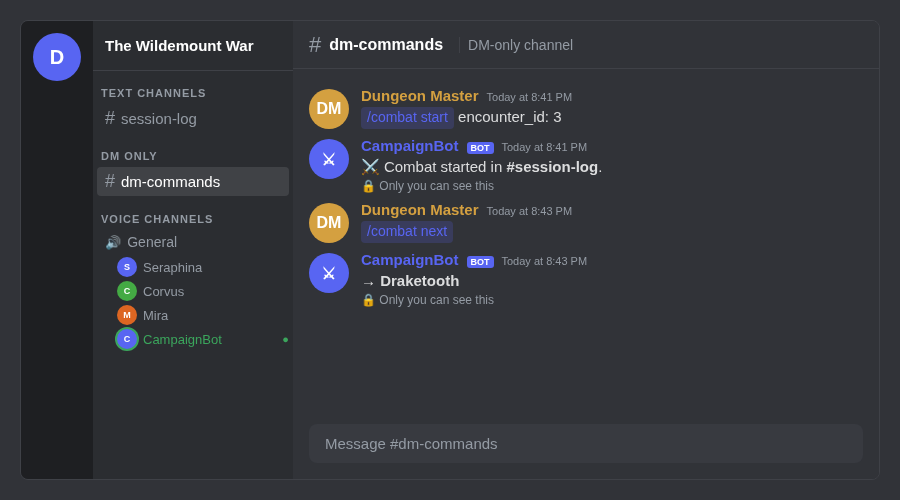

# D&D Campaign Discord Bot

A fully standalone Discord bot companion for Dungeon Masters running campaigns in **Wildemount** (Critical Role setting). Live combat tracker with HP bars and conditions, player character registration with spell slot tracking, procedural NPC/quest/map generation, 185 hand-crafted library NPCs with AI in-character dialogue, voice channel turn announcements, and deploy notifications — all from Discord slash commands.

[](https://discord.com/api/oauth2/authorize?client_id=1507476166494392420&permissions=117760&scope=bot%20applications.commands)
[](https://tkhemraj.github.io/dndcampaign-discordbot/demo.html)
[](https://railway.app)

---

## How it looks in Discord

### Live Combat Tracker
The DM controls combat privately. Players see a live embed that updates every turn — HP bars, conditions, and initiative order refresh silently without cluttering the channel.



### NPC Generator + Library
Generate fully statted Wildemount NPCs on the fly, or browse 185 hand-crafted library characters — 5 Legendary, 10 Mega, 20 Notable, 150 Standard. Summon any into your campaign with `/npc summon`, then ask them questions with `/npc speak`. AI dialogue auto-selects from Anthropic, OpenAI-compatible endpoints, Ollama, or a zero-dependency template fallback that requires no API key. All generation replies are ephemeral (DM-only); `/npc speak` replies post publicly to the player channel.



### Procedural Maps
BSP dungeon rooms, zone-based outdoor terrain, template interiors, and Wildemount-flavoured locations rendered as PNG. The renderer uses 28px tiles with wall stone block texture, per-room ambient warmth glow, floor bevel bevels, torch spot highlights, and a vignette border — generated fresh every time, posted to the player channel with `/map share`.



### Voice Channel Announcements
Configure a voice channel with `/setup voice_channel` and the bot joins automatically when combat starts — speaking each turn by name so nobody misses their go while the DM is narrating. Disconnects when combat ends.



> **[→ See the full interactive demo](https://tkhemraj.github.io/dndcampaign-discordbot/demo.html)**

---

## Features

| Feature | Commands | Who sees it |
|---|---|---|
| **Live combat tracker** | `/combat start/next/hp/initiative/end` | DM controls privately; players see live embed with 🛡️ player icons and battle summary on end |
| **Player characters** | `/pc register/view/list/hp/update/slots/cast/rest/inspire/retire` | Players register their own PCs; auto-join combat with correct stats; spell slot tracking |
| **Voice turn announcements** | `/setup voice_channel` | Bot joins VC on combat start, announces each turn via TTS, disconnects on end |
| **Deploy announcements** | automatic | Posts a green embed to player channel on every restart — shows commit SHA and what changed |
| **NPC generation + library** | `/npc generate`, `/npc library`, `/npc summon`, `/npc view`, `/npc list`, `/npc kill` | DM only (ephemeral) — procedural or hand-crafted library (185 NPCs: 5 Legendary, 10 Mega, 20 Notable, 150 Standard) |
| **AI NPC dialogue** | `/npc speak <id> <question>` | Posts in-character reply to player channel — Anthropic, OpenAI-compatible, Ollama, or zero-dependency template fallback |
| **Quest board** | `/quest generate`, `/quest board`, `/quest complete` | DM generates; board posts to player channel |
| **Procedural maps** | `/map generate`, `/map share` | DM previews privately; share posts PNG to channel — 28px tiles, wall stone texture, warmth glow |
| **Session recaps** | `/session log` | Posts rich embed to player channel |
| **Encounter builder** | `/encounter generate`, `/encounter list` | DM only (ephemeral) — named from roster, ready for `/combat start` |
| **Loot generator** | `/loot generate`, `/loot share`, `/loot list` | DM generates CR-aware Wildemount treasure (gems, art, magic items Common→Legendary); share to player channel |
| **Dice roller** | `/roll` | Any player or the DM — full expression support with advantage, keep-highest, and secret rolls |
| **Multi-campaign** | `/campaign new/select` | Multiple campaigns per server |
| **Autocomplete everywhere** | all commands | Region, faction, difficulty, condition, status — all dropdown-driven |

**Map types:** `dungeon` · `outdoor` · `interior` · `wildemount`  
**Dungeon subtypes:** `generic` · `underdark` · `crypt` · `sewers` · `cerberus_lab` · `bazzoxan`  
**Dice expressions:** `1d20` · `2d6+3` · `4d6kh3` · `1d20 adv` · `1d20 dis` · `2d8-1`

---

## Quick start

```bash
git clone https://github.com/tkhemraj/dndcampaign-discordbot
cd dndcampaign-discordbot
pip install -r requirements.txt
cp .env.example .env
# Edit .env — add your DISCORD_TOKEN
python run.py
```

Or deploy to Railway in one click — see [`Procfile`](Procfile) and [`nixpacks.toml`](nixpacks.toml).

---

## First-time server setup

Run these as the DM after adding the bot:

```
/setup role           @Dungeon Master       ← grants DM commands via role
/setup dm_channel     #dm-commands         ← OR restrict by channel
/setup player_channel #session-log         ← where the bot posts public updates
/setup voice_channel  #General             ← optional: VC for combat TTS announcements
/campaign new         "The Wildemount War" ← creates and activates a campaign
/setup status                              ← confirm everything is wired up
```

---

## DM access control

A user is treated as the DM if **either** is true:
1. They have the configured DM role (`/setup role`)
2. They are posting in the configured DM channel (`/setup dm_channel`)

Both gates can be active simultaneously — useful for having a `#dm-commands` channel AND a DM role on shared servers. All DM commands reply ephemerally so players never see them.

---

## Full command reference

<details>
<summary>Campaign</summary>

| Command | Description |
|---|---|
| `/campaign new <name>` | Create a new campaign |
| `/campaign select <id>` | Switch active campaign |
| `/campaign list` | List all campaigns |
| `/campaign info` | Show active campaign stats |

</details>

<details>
<summary>Generate</summary>

| Command | Description |
|---|---|
| `/npc generate [region] [faction]` | Generate + save a fully statted NPC (ephemeral) — region and faction are dropdown-autocompleted |
| `/npc library [tier] [region]` | Browse the 185-NPC hand-crafted library — filter by tier (Legendary/Mega/Notable/Standard) or region |
| `/npc summon <name>` | Pull any library NPC into your campaign DB with freshly rolled stats |
| `/npc speak <id> <question>` | Ask a saved NPC a question — AI reply posted publicly to player channel (Anthropic → OpenAI-compat → Ollama → template) |
| `/npc view <id>` | View a saved NPC's full stat card by ID (6-field inline stat block) |
| `/npc list [status]` | List saved NPCs (status: Alive / Dead / Unknown) |
| `/npc kill <id>` | Mark an NPC as dead |
| `/quest generate [region] [faction]` | Generate + save a quest hook (ephemeral) — region and faction are dropdown-autocompleted |
| `/quest board` | Post all active quests → player channel (single consolidated embed) |
| `/quest complete <id>` | Mark a quest as completed |
| `/encounter generate [size] [level] [difficulty]` | Generate + save an encounter — named from its actual roster (e.g. "Ambush: 3× Gnoll, Gnoll Pack Lord") |
| `/encounter list` | List recent encounters with status |

</details>

<details>
<summary>Maps</summary>

| Command | Description |
|---|---|
| `/map generate [type] [subtype]` | Generate a map — PNG preview (ephemeral) |
| `/map share [map_id]` | Post the map → player channel |
| `/map list` | List saved maps |

</details>

<details>
<summary>Combat</summary>

| Command | Description |
|---|---|
| `/combat start <encounter_id> [with_party]` | Start combat — posts live embed to player channel; `with_party:True` auto-imports registered PCs with correct HP/AC |
| `/combat next` | Advance turn (embed updates live) |
| `/combat hp <name> <delta>` | Heal or damage (`+5`, `-12`) |
| `/combat initiative <name> <value>` | Set or override a combatant's initiative |
| `/combat add <name> <hp> [ac] [initiative]` | Add combatant mid-fight |
| `/combat condition <name> <condition>` | Apply/remove a condition — all 15 D&D 5e conditions autocompleted |
| `/combat notes <name> <notes>` | Set combatant notes |
| `/combat remove <name>` | Remove a combatant |
| `/combat status` | View tracker privately |
| `/combat end` | End combat — embed turns green, shows rounds fought and fallen combatants |

</details>

<details>
<summary>Player Characters</summary>

| Command | Description |
|---|---|
| `/pc register <name> [race] [class] [level] [hp] [ac] [stats…]` | Register your character for the active campaign |
| `/pc view [name]` | View your own character sheet (or any by name) — shows HP bar, spell slots |
| `/pc list` | List all active PCs in the campaign |
| `/pc hp <delta>` | Update your own HP (`+8` heal, `-12` damage) |
| `/pc update [name] [field] [value]` | Update character fields (DM can update any PC; players update their own) |
| `/pc slots <level1_max> [level2_max] …` | Set spell slot maximums |
| `/pc cast <slot_level>` | Expend a spell slot |
| `/pc rest` | Long rest — resets HP to max and refills all spell slots |
| `/pc inspire` | Toggle inspiration on/off |
| `/pc retire <name>` | Retire a character (DM only) |

Spell slots are stored as JSON per level: `{"1": [current, max], "2": [current, max], …}`.  
HP bar displays as `█████░░░░░` (10-block bar). Registered PCs auto-join combat when `/combat start with_party:True` is used.

</details>

<details>
<summary>Loot</summary>

| Command | Description |
|---|---|
| `/loot generate [cr]` | Generate CR-aware loot — coins, gems, art objects, magic items (DM-only, ephemeral) |
| `/loot share <loot_id>` | Post loot card to the player channel |
| `/loot list` | List recent loot cards with IDs |

**Magic item rarities scale with CR:** Common (CR 1–3) · Uncommon (CR 4–7) · Rare (CR 8–12) · Very Rare (CR 13–17) · Legendary (CR 18+)

</details>

<details>
<summary>Dice</summary>

| Command | Description |
|---|---|
| `/roll <expression>` | Roll dice — posted to channel for all players to see |
| `/roll <expression> secret:True` | Secret roll — ephemeral, only you see it |

**Syntax:** `1d20` · `2d6+3` · `4d6kh3` (keep highest 3) · `2d20kl1` (keep lowest 1) · `1d20 adv` · `1d20 dis`

</details>

<details>
<summary>Session</summary>

| Command | Description |
|---|---|
| `/session log <title> <notes>` | Post session recap → player channel |
| `/session history [limit]` | Show recent session recaps |

</details>

<details>
<summary>Setup</summary>

| Command | Description |
|---|---|
| `/setup role <role>` | Set the DM role |
| `/setup dm_channel <channel>` | Set the DM-only text channel |
| `/setup player_channel <channel>` | Set the player text channel |
| `/setup voice_channel <channel>` | Set the voice channel for combat TTS announcements |
| `/setup status` | Show current configuration |

</details>

---

## Database modes

| Mode | Env var | Description |
|---|---|---|
| **Standalone** (default) | `USE_SHARED_DB=0` | Bot uses its own `campaign.db` |
| **Shared** | `USE_SHARED_DB=1` | Reads `../dndcampaign/dndcampaign.db` — synced with the [companion web app](https://github.com/tkhemraj/dndcampaign) |
